# 第10章 购物车

## 学习目标

- 掌握购物车流程

- 掌握购物车渲染流程

- OAuth2.0认证并获取用户令牌数据

- 微服务与微服务之间的认证


## 1 SpringSecurity权限控制


​	用户每次访问微服务的时候，先去oauth2.0服务登录，登录后再访问微服务网关，微服务网关将请求转发给其他微服务处理。

​	由于我们项目使用了微服务，任何用户都有可能使用任意微服务，此时我们需要控制相关权限，例如：普通用户角色不能使用用户的删除操作，只有管理员才可以使用,那么这个时候就需要使用到SpringSecurity的权限控制功能了。

### 1.1 角色权限加载

在changgou-user-oauth服务中，com.changgou.oauth.config.UserDetailsServiceImpl该类实现了加载用户相关信息，如下代码：


上述代码给登录用户定义了三个角色，分别为`salesman`,`accountant`,`user`，这一块我们目前使用的是硬编码方式将角色写死了。


### 1.2 角色权限控制

在每个微服务中，需要获取用户的角色，然后根据角色识别是否允许操作指定的方法，Spring Security中定义了四个支持权限控制的表达式注解，分别是`@PreAuthorize`、`@PostAuthorize`、`@PreFilter`和`@PostFilter`。其中前两者可以用来在方法调用前或者调用后进行权限检查，后两者可以用来对集合类型的参数或者返回值进行过滤。在需要控制权限的方法上，我们可以添加`@PreAuthorize`注解，用于方法执行前进行权限检查，校验用户当前角色是否能访问该方法。

(1)开启@PreAuthorize

在`changgou-user-service`的`ResourceServerConfig`类上添加`@EnableGlobalMethodSecurity`注解，用于开启@PreAuthorize的支持，代码如下：


(2)方法权限控制

在`changgoug-service-user`微服务的`com.changgou.user.controller.UserController`类的delete()方法上添加权限控制注解`@PreAuthorize`，代码如下：


(3)测试

我们使用Postman测试，先创建令牌，然后将令牌数存放到头文件中访问微服务网关来调用user微服务的search方法，效果如下：

地址：`http://localhost:8001/api/user/search/1/10`  提交方式：GET

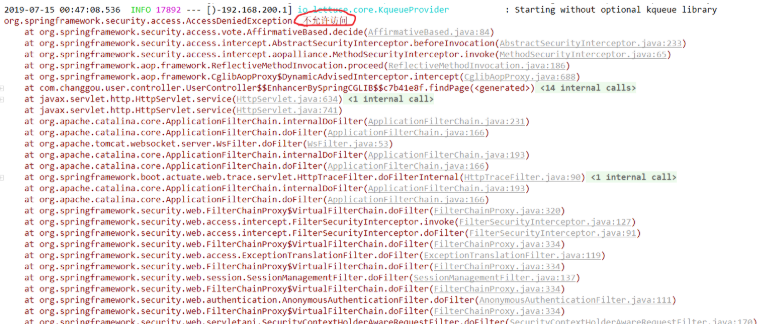

发现上面无法访问，因为用户登录的时候，角色不包含admin角色，而search方法需要admin角色，所以被拦截了。


我们再测试其他方法，其他方法没有配置拦截，所以用户登录后就会放行。

访问`http://localhost:8001/api/user`

效果如下：

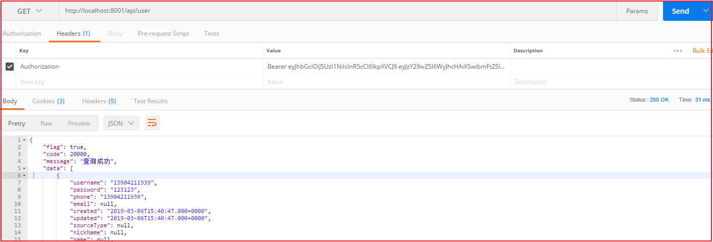


### 1.3 小结

如果希望一个方法能被多个角色访问，配置:`@PreAuthorize("hasAnyAuthority('admin','user')")`

如果希望一个类都能被多个角色访问，在类上配置:`@PreAuthorize("hasAnyAuthority('admin','user')")`


## 2 购物车

购物车分为用户登录购物车和未登录购物车操作，国内知名电商京东用户登录和不登录都可以操作购物车，如果用户不登录，操作购物车可以将数据存储到Cookie，用户登录后购物车数据可以存储到Redis中，再将之前未登录加入的购物车合并到Redis中即可。

淘宝天猫则采用了另外一种实现方案，用户要想将商品加入购物车，必须先登录才能操作购物车。

我们今天实现的购物车是天猫解决方案，即用户必须先登录才能使用购物车功能。


### 2.1 购物车业务分析

(1)需求分析

用户在商品详细页点击加入购物车，提交商品SKU编号和购买数量，添加到购物车。购物车展示页面如下：


(2)购物车实现思路


我们实现的是用户登录后的购物车，用户将商品加入购物车的时候，直接将要加入购物车的详情存入到Redis即可。每次查看购物车的时候直接从Redis中获取。


(3)表结构分析

用户登录后将商品加入购物车，需要存储商品详情以及购买数量，购物车详情表如下：

changgou_order数据中tb_order_item表：

```sql
CREATE TABLE `tb_order_item` (
  `id` varchar(20) COLLATE utf8_bin NOT NULL COMMENT 'ID',
  `category_id1` int(11) DEFAULT NULL COMMENT '1级分类',
  `category_id2` int(11) DEFAULT NULL COMMENT '2级分类',
  `category_id3` int(11) DEFAULT NULL COMMENT '3级分类',
  `spu_id` varchar(20) COLLATE utf8_bin DEFAULT NULL COMMENT 'SPU_ID',
  `sku_id` bigint(20) NOT NULL COMMENT 'SKU_ID',
  `order_id` bigint(20) NOT NULL COMMENT '订单ID',
  `name` varchar(200) COLLATE utf8_bin DEFAULT NULL COMMENT '商品名称',
  `price` int(20) DEFAULT NULL COMMENT '单价',
  `num` int(10) DEFAULT NULL COMMENT '数量',
  `money` int(20) DEFAULT NULL COMMENT '总金额',
  `pay_money` int(11) DEFAULT NULL COMMENT '实付金额',
  `image` varchar(200) COLLATE utf8_bin DEFAULT NULL COMMENT '图片地址',
  `weight` int(11) DEFAULT NULL COMMENT '重量',
  `post_fee` int(11) DEFAULT NULL COMMENT '运费',
  `is_return` char(1) COLLATE utf8_bin DEFAULT NULL COMMENT '是否退货',
  PRIMARY KEY (`id`),
  KEY `item_id` (`sku_id`),
  KEY `order_id` (`order_id`)
) ENGINE=InnoDB DEFAULT CHARSET=utf8 COLLATE=utf8_bin;
```


### 2.2 添加购物车

#### 2.2.1 获取sku数据

goods服务中定义根据id查询sku对象实现

```java
@RestController
@CrossOrigin
@RequestMapping("/sku")
public class SkuController {


    @Autowired
    private SkuService skuService;

     @GetMapping("/{id}")
    public Result<Sku> findById(@PathVariable("id") String id){
        Sku sku = skuService.findById(id);
        return new Result(true,StatusCode.OK,"查询成功",sku);
    }
}
```

#### 2.2.2 定义feign接口

goods-api工程中定义skuFeign接口,并定义查询方法

```java
 /**
     * 根据id查询sku信息
     * @param id
     * @return
     */
    @GetMapping("/{id}")
    public Result<Sku> findById(@PathVariable("id") String id);
```


#### 2.2.3 订单服务添加依赖

```xml
<dependency>
    <groupId>com.changgou</groupId>
    <artifactId>changgou_service_goods_api</artifactId>
    <version>1.0-SNAPSHOT</version>
</dependency>
```


#### 2.2.4 订单服务启动类添加feign接口扫描

```java
@EnableFeignClients(basePackages = "com.changgou.goods.feign")
```


#### 2.2.5  订单服务新建CartController

```java
@RestController
@CrossOrigin
@RequestMapping("/cart")
public class CartController {

    @Autowired
    private CartService cartService;

    /**
     * 添加购物车
     * @param skuId 
     * @param num
     * @return
     */
    @GetMapping("/add")
    public Result add(@RequestParam("skuId") String skuId, @RequestParam("num") Integer num){

        //暂时静态,后续动态获取
        String username = "itcast";
        cartService.add(skuId,num,username);

        return new Result(true, StatusCode.OK,"加入购物车成功");

    }
}
```


#### 2.2.6 订单服务添加cartService，实现添加购物车

代码如下：

```java
@Service
public class CartServiceImpl implements CartService {

    private static final String CART="Cart_";

    @Autowired
    private RedisTemplate redisTemplate;

    @Autowired
    private SkuFeign skuFeign;

    @Autowired
    private SpuFeign spuFeign;

    /**
     * 添加购物车
     * @param skuId
     * @param num
     */
    @Override
    public void add(String skuId, Integer num,String username) {

        /**
         * 1）查询redis中的数据
         * 2）如果redis中已经有了，则追加数量，重新计算金额
         * 3）如果没有，将商品添加到缓存
         */
        OrderItem orderItem = (OrderItem) redisTemplate.boundHashOps(CART+username).get(skuId);
        if (orderItem != null){
            //存在，刷新购物车
            orderItem.setNum(orderItem.getNum()+num);
            orderItem.setMoney(orderItem.getNum()*orderItem.getPrice());
            orderItem.setPayMoney(orderItem.getNum()*orderItem.getPrice());
        }else{
            //不存在，新增购物车
            Result<Sku> skuResult = skuFeign.findById(skuId);
            Sku sku = skuResult.getData();
            Spu spu = spuFeign.findByspuId(sku.getSpuId());

            //将SKU转换成OrderItem
            orderItem = this.sku2OrderItem(sku,spu,num);
        }

        //存入redis
        redisTemplate.boundHashOps(CART+username).put(skuId,orderItem);


    }

    //sku转换为orderItem
    private OrderItem sku2OrderItem(Sku sku, Spu spu, Integer num) {
        OrderItem orderItem = new OrderItem();
        orderItem.setSpuId(sku.getSpuId());
        orderItem.setSkuId(sku.getId());
        orderItem.setName(sku.getName());
        orderItem.setPrice(sku.getPrice());
        orderItem.setNum(num);
        orderItem.setMoney(num*orderItem.getPrice());       //单价*数量
        orderItem.setPayMoney(num*orderItem.getPrice());    //实付金额
        orderItem.setImage(sku.getImage());
        orderItem.setWeight(sku.getWeight()*num);           //重量=单个重量*数量

        //分类ID设置
        orderItem.setCategoryId1(spu.getCategory1Id());
        orderItem.setCategoryId2(spu.getCategory2Id());
        orderItem.setCategoryId3(spu.getCategory3Id());
        return orderItem;
    }
}
```


测试添加购物车，效果如下：

请求地址` localhost:9004/cart/add?skuId=100000022652&num=1 `

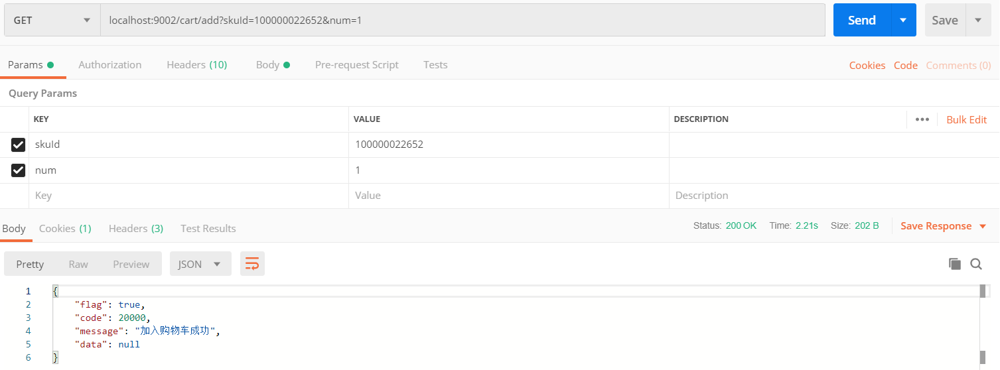

Redis缓存中已经有商品了


### 2.4 购物车列表

#### 2.4.1 思路分析


接着我们实现一次购物车列表操作。因为存的时候是根据用户名往Redis中存储用户的购物车数据的，所以我们这里可以将用户的名字作为key去Redis中查询对应的数据。


#### 3.4.2 代码实现

(1)控制层

com.changgou.order.controller.CartController类，添加购物车列表查询方法，代码如下：

```java
/***
 * 查询用户购物车列表
 * @return
*/
@GetMapping(value = "/list")
public Map list(){
    //暂时静态，后续修改
    String username = "itcast";
    return cartService.list(username);
}
```


(2)业务层

业务层接口

com.changgou.order.service.CartService接口，添加购物车列表方法，代码如下：

```java
/***
  * 查询用户的购物车数据
  * @return
  */
 Map list(String username);
```


业务层接口实现类

com.changgou.order.service.impl.CartServiceImpl类，添加购物车列表实现方法，代码如下：

```java
/**
     * 获取购物车列表数据
     * @param username
     * @return
     */
    @Override
    public Map list(String username) {
        Map map = new HashMap();

        List<OrderItem> orderItemList = redisTemplate.boundHashOps(CART+username).values();

        map.put("orderItemList",orderItemList);

        //商品数量与总价格
        Integer totalNum = 0;
        Integer totalPrice = 0;

        for (OrderItem orderItem : orderItemList) {
            totalNum +=orderItem.getNum();
            totalPrice+=orderItem.getMoney();
        }
        map.put("totalNum",totalNum);
        map.put("totalPrice",totalPrice);
        return map;
    }
```


(3)测试

使用Postman访问 GET http://localhost:9004/cart/list ,效果如下：

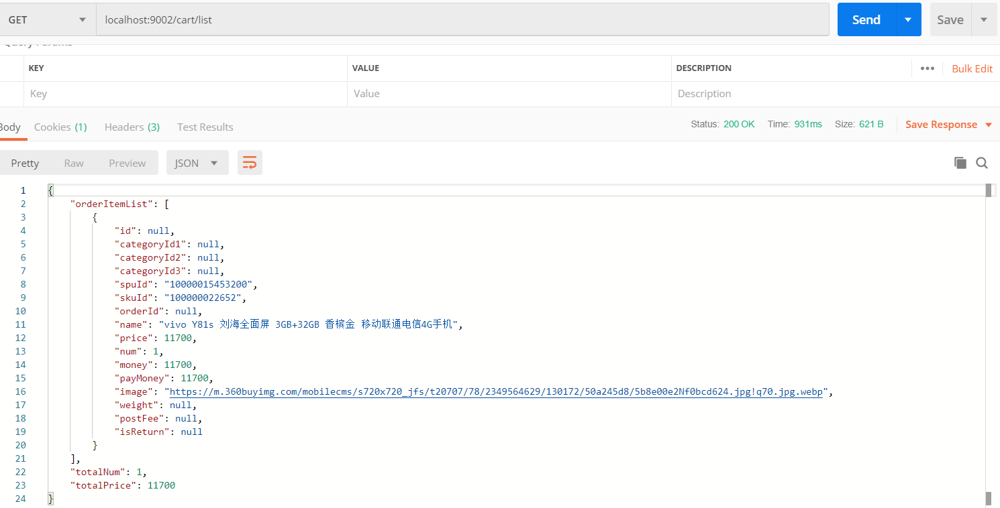


## 3 购物车渲染


​	如上图所示,用户每次将商品加入购物车，或者点击购物车列表的时候，先经过订单购物车后端渲染服务，再通过feign调用购物车订单微服务来实现购物车的操作，例如：加入购物车、购物车列表。


### 3.1 购物车渲染服务搭建

在changgou_web中搭建订单购物车微服务工程`changgou_web_order`，该工程主要实现购物车和订单的渲染操作。

(1) pom.xml依赖

```xml
<dependencies>
    <dependency>
        <groupId>com.changgou</groupId>
        <artifactId>changgou_service_order_api</artifactId>
        <version>1.0-SNAPSHOT</version>
    </dependency>
    <dependency>
        <groupId>com.changgou</groupId>
        <artifactId>changgou_common</artifactId>
        <version>1.0-SNAPSHOT</version>
    </dependency>
    <dependency>
        <groupId>org.springframework.boot</groupId>
        <artifactId>spring-boot-starter-thymeleaf</artifactId>
    </dependency>
</dependencies>
```

(2)application.yml配置

```properties
server:
  port: 9011
spring:
  application:
    name: order-web
  main:
    allow-bean-definition-overriding: true   #当遇到同样名字的时候，是否允许覆盖注册
  thymeleaf:
    cache: false
eureka:
  client:
    service-url:
      defaultZone: http://127.0.0.1:6868/eureka
  instance:
    prefer-ip-address: true
feign:
  hystrix:
    enabled: true
  client:
    config:
      default:   #配置全局的feign的调用超时时间  如果 有指定的服务配置 默认的配置不会生效
        connectTimeout: 60000 # 指定的是 消费者 连接服务提供者的连接超时时间 是否能连接  单位是毫秒
        readTimeout: 80000  # 指定的是调用服务提供者的 服务 的超时时间（）  单位是毫秒
#hystrix 配置
hystrix:
  command:
    default:
      execution:
        timeout:
          #如果enabled设置为false，则请求超时交给ribbon控制
          enabled: true
        isolation:
          strategy: SEMAPHORE
          thread:
            # 熔断器超时时间，默认：1000/毫秒
            timeoutInMilliseconds: 80000
#请求处理的超时时间
ribbon:
  ReadTimeout: 4000
  #请求连接的超时时间
  ConnectTimeout: 3000
```

(3)创建启动类

创建com.changgou.OrderWebApplication启动类，代码如下：

```java
@SpringBootApplication
@EnableEurekaClient
public class OrderWebApplication {

    public static void main(String[] args) {
        SpringApplication.run(OrderWebApplication.class,args);
    }
}
```

(4)静态资源拷贝

资源\成品页面\cart.html页面拷贝到工程中，如下图：


### 3.2 购物车列表渲染

#### 3.2.1 Feign创建

在changgou_service_order_api中添加CartFeign接口，并在接口中创建添加购物车和查询购物车列表，代码如下：

```java
@FeignClient(name="order")
public interface CartFeign {

    /**
     * 添加购物车
     * @param skuId
     * @param num
     * @return
     */
    @GetMapping("/cart/add")
    public Result add(@RequestParam("skuId") String skuId, @RequestParam("num") Integer num);

    /***
     * 查询用户购物车列表
     * @return
     */
    @GetMapping(value = "/cart/list")
    public Map list();
}
```

#### 3.2.2 后台代码

在changgou_web_order中创建com.changgou.order.controller.CartController,并添加查询购物车集合方法和添加购物车方法，代码如下：

```java
@Controller
@RequestMapping("/wcart")
public class CartController {

    @Autowired
    private CartFeign cartFeign;

    /**
     * 查询
     */
    @GetMapping("/list")
    public String list(Model model){
        Map map = cartFeign.list();
        model.addAttribute("items",map);
        return "cart";
    }

    /**
     * 添加购物车
     */
    @GetMapping("/add")
    @ResponseBody
    public Result<Map> add(String id, Integer num){

        cartFeign.add(id, num);

        Map map = cartFeign.list();
        return new Result<>(true, StatusCode.OK,"添加购物车成功",map);
    }
}
```

#### 3.2.3 前端页面

(1)加载列表数据

我们可以先在网页下面添加一个js脚本，用于加载购物车数据，并用一个对象存储，代码如下：

```html
<!-- vue loadlist -->
						<div class="cart-list" v-for="item in items.orderItemList" :key="item.index">
							<ul class="goods-list yui3-g">
								<li class="yui3-u-1-24">
									<input type="checkbox" name="chk_list" id="" value="" />
								</li>
								<li class="yui3-u-6-24">
									<div class="good-item">
										<div class="item-img">
											
										</div>
										<div class="item-msg"></div>
									</div>
								</li>
								<li class="yui3-u-5-24">
									<div class="item-txt">{{item.name}}</div>
								</li>
								<li class="yui3-u-1-8">
									<span class="price">{{item.price}}</span>
								</li>
								<li class="yui3-u-1-8">
									<a href="javascript:void(0)" @click="add(item.skuId,-1)" class="increment mins">-</a>
									<input autocomplete="off" type="text" v-model="item.num" @blur="add(item.skuId,item.num)" value="1" minnum="1" class="itxt" />
									<a href="javascript:void(0)" @click="add(item.skuId,1)" class="increment plus">+</a>
								</li>
								<li class="yui3-u-1-8">
									<span class="sum">{{item.num*item.price}}</span>
								</li>
								<li class="yui3-u-1-8">
									<a href="#none">删除</a>
									<br />
									<a href="#none">移到收藏</a>
								</li>
							</ul>
						</div>

					</div>
				</div>
			</div>
			<div class="cart-tool">
				<div class="select-all">
					<input class="chooseAll" type="checkbox" name="" id="" value="" />
					<span>全选</span>
				</div>
				<div class="option">
					<a href="#none">删除选中的商品</a>
					<a href="#none">移到我的关注</a>
					<a href="#none">清除下柜商品</a>
				</div>
				<div class="money-box">
					<div class="chosed">已选择
						<span>{{items.totalNum}}</span>件商品</div>
					<div class="sumprice">
						<span>
							<em>总价（不含运费） ：</em>
							<i class="summoney">¥{{items.totalMoney}}</i>
						</span>
						<span>
							<em>已节省：</em>
							<i>-¥20.00</i>
						</span>
					</div>
					<div class="sumbtn">
						<a class="sum-btn" href="getOrderInfo.html" target="_blank">结算</a>
					</div>
				</div>
			</div>
```

```javascript
<script th:inline="javascript">
		var app = new Vue({
			el: '#app',
			data() {
				return {
					items: [[${items}]]
				}
			},
			methods:{
				add:function (skuId, num) {
					axios.get("/wcart/add?skuId="+skuId+"&num="+num).then(function (response) {
						if (response.data.flag){
							app.items=response.data.data
						}
					})
				}
			}
		})
	</script>
```


运行之后，效果如下：

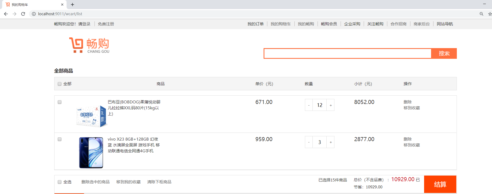


### 3.3 商品数量变更

​	用户可以点击+号或者-号，或者手动输入一个数字，然后更新购物车列表，我们可以给-+号一个点击事件，给数字框一个失去焦点事件，然后调用后台，实现购物车的更新。

请求后台方法：

在js里面创建一个请求后台的方法，代码如下：

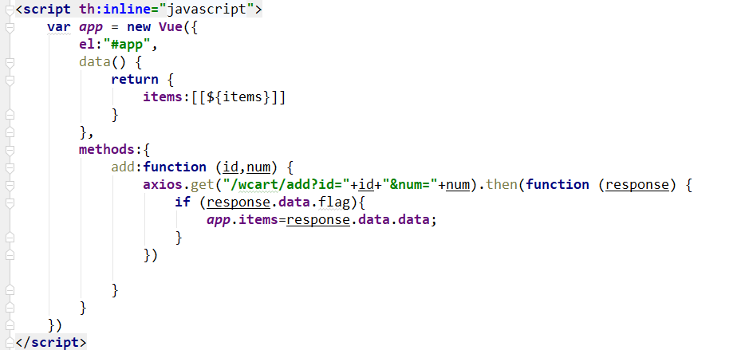

添加事件：

在+-号和数字框那里添加点击事件和失去焦点事件，然后调用上面的add方法，代码如下：


### 3.4 删除商品购物车

我们发现个问题，就是用户将商品加入购物车，无论数量是正负，都会执行添加购物车，如果数量如果<=0，应该移除该商品的。

修改changgou-service-order的com.changgou.order.service.impl.CartServiceImpl的add方法，添加如下代码：


### 3.5 订单服务对接oauth

1）配置公钥

2）oauth依赖

```xml
<dependency>
    <groupId>org.springframework.cloud</groupId>
    <artifactId>spring-cloud-starter-oauth2</artifactId>
</dependency>
```

3) 添加配置类

```java
@Configuration
@EnableResourceServer
//开启方法上的PreAuthorize注解
@EnableGlobalMethodSecurity(prePostEnabled = true, securedEnabled = true)
public class ResourceServerConfig extends ResourceServerConfigurerAdapter {

    //公钥
    private static final String PUBLIC_KEY = "public.key";

    /***
     * 定义JwtTokenStore
     * @param jwtAccessTokenConverter
     * @return
     */
    @Bean
    public TokenStore tokenStore(JwtAccessTokenConverter jwtAccessTokenConverter) {
        return new JwtTokenStore(jwtAccessTokenConverter);
    }

    /***
     * 定义JJwtAccessTokenConverter
     * @return
     */
    @Bean
    public JwtAccessTokenConverter jwtAccessTokenConverter() {
        JwtAccessTokenConverter converter = new JwtAccessTokenConverter();
        converter.setVerifierKey(getPubKey());
        return converter;
    }
    /**
     * 获取非对称加密公钥 Key
     * @return 公钥 Key
     */
    private String getPubKey() {
        Resource resource = new ClassPathResource(PUBLIC_KEY);
        try {
            InputStreamReader inputStreamReader = new InputStreamReader(resource.getInputStream());
            BufferedReader br = new BufferedReader(inputStreamReader);
            return br.lines().collect(Collectors.joining("\n"));
        } catch (IOException ioe) {
            return null;
        }
    }

    /***
     * Http安全配置，对每个到达系统的http请求链接进行校验
     * @param http
     * @throws Exception
     */
    @Override
    public void configure(HttpSecurity http) throws Exception {
        //所有请求必须认证通过
        http.authorizeRequests()
                .anyRequest().
                authenticated();    //其他地址需要认证授权
    }
}
```

### 3.6 微服务间认证


如上图：因为微服务之间并没有传递头文件，所以我们可以定义一个拦截器，每次微服务调用之前都先检查下头文件，将请求的头文件中的令牌数据再放入到header中，再调用其他微服务即可。

测试访问购物车，产生如下效果：

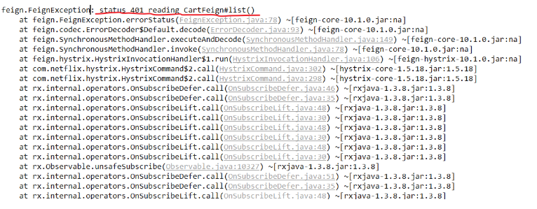

#### 3.6.1 feign拦截器实现微服务间认证

(1)创建拦截器

在changgou_common服务中创建一个com.changgou.interceptor.FeignInterceptor拦截器，并将所有头文件数据再次加入到Feign请求的微服务头文件中，代码如下：

```java
@Component
public class FeignInterceptor implements RequestInterceptor {

    @Override
    public void apply(RequestTemplate requestTemplate) {

        RequestAttributes requestAttributes = RequestContextHolder.getRequestAttributes();

        if (requestAttributes!=null){

            HttpServletRequest request = ((ServletRequestAttributes) requestAttributes).getRequest();
            if (request!=null){
                Enumeration<String> headerNames = request.getHeaderNames();
                if (headerNames!=null){
                    while (headerNames.hasMoreElements()){
                        String headerName = headerNames.nextElement();
                        if (headerName.equals("authorization")){
                            String headerValue = request.getHeader(headerName);
                            requestTemplate.header(headerName,headerValue);
                        }
                    }
                }
            }
        }
        }
}
```

2) 更改changgou_order_web启动类，添加拦截器声明

```java
@Bean
public FeignInterceptor feignInterceptor(){
    return new FeignInterceptor();
}
```

### 3.7 购物车渲染服务、订单服务对接网关

1)  修改微服务网关`changgou-gateway-web`的application.yml配置文件，添加order的路由过滤配置，配置如下：

```yml
            #订单微服务
            - id: changgou_order_route
              uri: lb://order
              predicates:
              - Path=/api/cart/**,/api/categoryReport/**,/api/orderConfig/**,/api/order/**,/api/orderItem/**,/api/orderLog/**,/api/preferential/**,/api/returnCause/**,/api/returnOrder/**,/api/returnOrderItem/**
              filters:
              - StripPrefix=1
            #购物车订单渲染微服务
            - id: changgou_order_web_route
              uri: lb://order-web
              predicates:
              - Path=/api/wcart/**
              filters:
              - StripPrefix=1
```

2)  添加自定义路径过滤类

```java
public class UrlFilter {

    //购物车订单微服务都需要用户登录，必须携带令牌，所以所有路径都过滤,订单微服务需要过滤的地址
    public static String orderFilterPath = "/api/wxpay,/api/wxpay/**,/api/worder/**,/api/user/**,/api/address/**,/api/wcart/**,/api/cart/**,/api/categoryReport/**,/api/orderConfig/**,/api/order/**,/api/orderItem/**,/api/orderLog/**,/api/preferential/**,/api/returnCause/**,/api/returnOrder/**,/api/returnOrderItem/**";

    public static boolean hasAuthorize(String url){

        String[] strings = orderFilterPath.replace("**", "").split(",");
        for (String value : strings) {

            if (url.startsWith(value)){
                return true;
            }
        }
        return false;
    }
}
```

3)  更改网关全局过滤器


### 3.8  动态获取当前登陆人

#### 3.8.1 数据分析

用户登录后，数据会封装到`SecurityContextHolder.getContext().getAuthentication()`里面，我们可以将数据从这里面取出，然后转换成`OAuth2AuthenticationDetails`,在这里面可以获取到令牌信息、令牌类型等，代码如下：

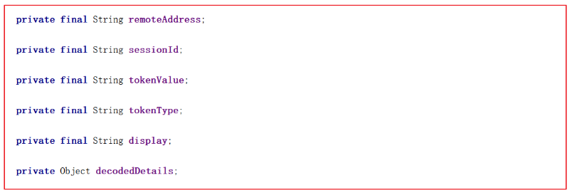

​	这里的tokenValue是加密之后的令牌数据，remoteAddress是用户的IP信息，tokenType是令牌类型。

​	我们可以获取令牌加密数据后，使用公钥对它进行解密，如果能解密说明数据无误，如果不能解密用户也没法执行到这一步。解密后可以从明文中获取用户信息。

#### 5.4.2 代码实现

因为该类在很多微服务中都会被使用到，所以需要将该类添加到common工程中

（1）在changgou-common工程中引入鉴权包

```xml
<!--鉴权-->
<dependency>
    <groupId>io.jsonwebtoken</groupId>
    <artifactId>jjwt</artifactId>
    <version>0.9.0</version>
    <scope>provided</scope>
</dependency>
```


（2）添加资源中的TokenDecode工具类到changgou-service-order微服务config包下，用于解密令牌信息

代码如下：


（3）将该工具类以bean的形式声明到order服务中

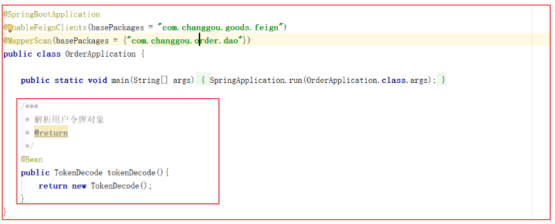

(4)控制层获取用户数据

在CartController中注入TokenDecode，并调用TokenDecode的getUserInfo方法获取用户信息，代码如下：

注入TokenDecode：

```java
@Autowired
private TokenDecode tokenDecode;
```

获取用户名：

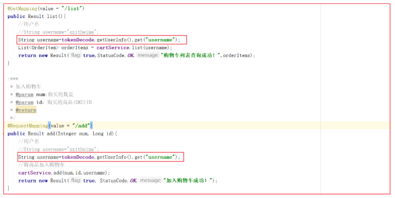

### 3.9 页面配置

#### 3.9.1 静态化资源加载

之前已经完成了登录页面的功能实现，当登录成功之后，我们再打开之前的购物车页面，效果如下图：

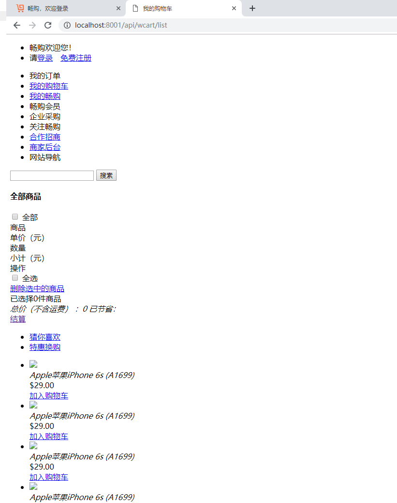

​	这个时候，我们发现所有样式都没有了，这是因为我们这里请求地址经过了微服务网关，会基于网关加载静态化资源，但是此时网关工程中并没有相关资源，所以这时候会造成404问题。要解决此问题的话，只需要将相关静态化资源放入网关工程并重新访问即可。

​	再次测试，访问http://localhost:8001/api/wcart/list

​	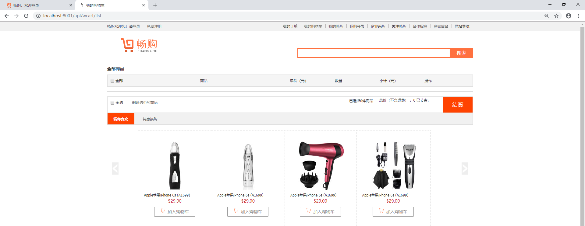

#### 3.9.2 未登录时登录跳转

​	在用户没有登录的情况下，直接访问购物车页面，效果如下：

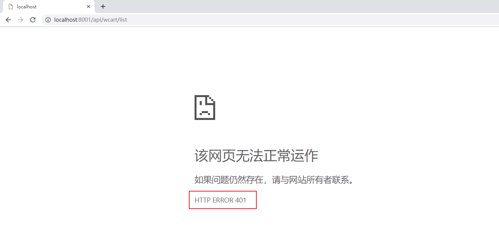

​	我们可以发现，返回的只是个错误状态码，这个毫无意义，我们应该重定向到登录页面，让用户登录，我们可以修改网关的头文件，让用户每次没登录的时候，都跳转到登录页面。

​	修改changgou-gateway-web的`com.changgou.filter.AuthorizeFilter`，代码如下：

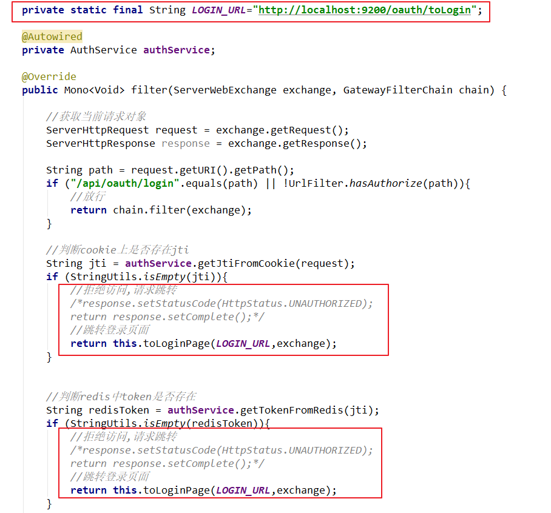


此时再测试，就可以跳转到登录页面了。

访问：http://localhost:8001/api/wcart/list

#### 3.9.3 登录成功跳转原地址

​	刚才已经实现了未登录时跳转登录页，但是当登录成功后，并没有跳转到用户本来要访问的页面。

​	要实现这个功能的话，可以将用户要访问的页面作为参数传递到登录控制器，由登录控制器根据参数完成路径跳转

1) 修改网关携带当前访问URI

修改changgou-gateway-web的`com.changgou.filter.AuthorizeFilter`，在之前的URL后面添加FROM参数以及FROM参数的值为`request.getURI()`，代码如下：


2）登录控制器获取参数

修改changgou-user-oauth的`com.changgou.oauth.controller.LoginRedirect`记录访问来源页，代码如下：


3) 修改页面，获取来源页信息，并存到from变量中，登录成功后跳转到该地址。

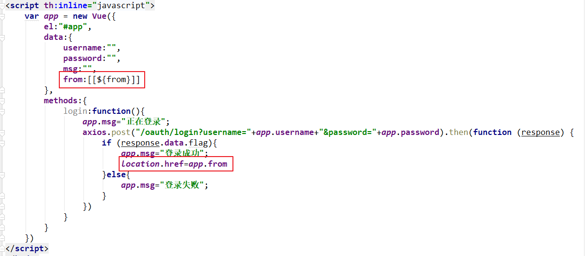

此时再测试，就可以识别未登录用户，跳转到登录页，然后根据登录状态，如果登录成功，则跳转到来源页。


